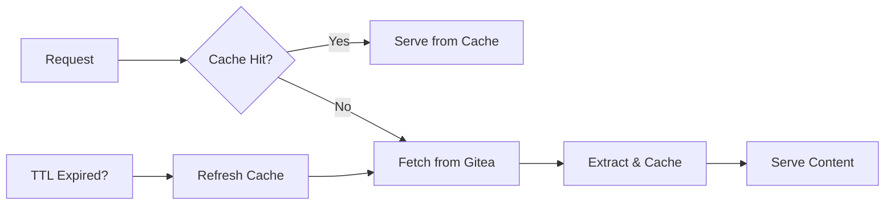

<div align="center">

# 🚀 Caddy Gitea Pages

**Transform your Gitea into a powerful static site hosting platform**

[](https://github.com/rsp2k/caddy-gitea-pages/actions/workflows/test.yml)
[](https://github.com/rsp2k/caddy-gitea-pages/actions/workflows/release.yml)
[](https://goreportcard.com/report/github.com/rsp2k/caddy-gitea-pages)
[](https://pkg.go.dev/github.com/rsp2k/caddy-gitea-pages)

*A powerful Caddy module that brings GitHub Pages-like functionality to your self-hosted Gitea instance*

[🚀 Quick Start](#-quick-start) • [📖 Documentation](#-configuration) • [🎯 Examples](#-usage-patterns) • [🤝 Contributing](#-contributing)

</div>

---

## ✨ What is Caddy Gitea Pages?

Caddy Gitea Pages is a **modern, lightweight** Caddy module that transforms your self-hosted Gitea instance into a powerful static site hosting platform. Just like GitHub Pages, but for your own infrastructure! 

🎯 **Perfect for:**
- Personal portfolios and blogs
- Project documentation sites  
- Corporate websites and landing pages
- Multi-tenant hosting platforms
- Developer-friendly static site deployments

---

## 🌟 Key Features

<table>
<tr>
<td width="33%">

### 🌐 **Smart Domain Mapping**
- Custom domain support
- Automatic subdomain routing
- Flexible pattern matching
- GitHub Pages-style user sites

</td>
<td width="33%">

### ⚡ **High Performance**
- Built-in intelligent caching
- TTL-based cache invalidation
- Efficient tar.gz extraction
- Caddy's native performance

</td>
<td width="33%">

### 🔒 **Secure & Flexible**
- Token-based authentication
- Private repository support
- Path traversal protection
- Environment variable config

</td>
</tr>
</table>

### 📋 **Complete Feature List**

- ✅ **Static Site Hosting** - Serve websites directly from Gitea repos
- ✅ **Custom Domain Mapping** - Map any domain to any repository  
- ✅ **Automatic Domain Resolution** - Smart subdomain-to-repo mapping
- ✅ **Multi-Branch Support** - Serve from any branch (main, gh-pages, etc.)
- ✅ **Intelligent Caching** - Fast response times with smart cache management
- ✅ **Index File Detection** - Automatic index.html/index.htm serving
- ✅ **Private Repository Support** - Access control via Gitea tokens
- ✅ **Multiple Hosting Patterns** - From simple to enterprise-grade setups

---

## 🚀 Quick Start

### 📦 Installation

#### Option 1: Using xcaddy (Recommended)

```bash
# Install xcaddy
go install github.com/caddyserver/xcaddy/cmd/xcaddy@latest

# Build Caddy with the module
xcaddy build --with github.com/rsp2k/caddy-gitea-pages
```

#### Option 2: Development Build

```bash
# Clone the repository
git clone https://github.com/rsp2k/caddy-gitea-pages.git
cd caddy-gitea-pages

# Build with local module
go mod tidy
xcaddy build --with github.com/rsp2k/caddy-gitea-pages=.
```

### ⚙️ Basic Configuration

Create a simple `Caddyfile`:

```caddyfile
pages.example.com {
    gitea_pages {
        gitea_url https://git.example.com
        gitea_token {env.GITEA_TOKEN}
        cache_ttl 15m
    }
}
```

Set your Gitea token:
```bash
export GITEA_TOKEN=your_gitea_access_token_here
```

**That's it!** 🎉 Your Gitea Pages server is ready!

---

## 📖 Configuration

### 🔧 Configuration Options

| Option | Description | Default | Example |
|--------|-------------|---------|---------|
| `gitea_url` | 🌐 Your Gitea instance URL | **Required** | `https://git.example.com` |
| `gitea_token` | 🔑 API access token | Optional | `{env.GITEA_TOKEN}` |
| `cache_dir` | 📁 Cache storage location | `$CADDY_DATA/gitea_pages_cache` | `/var/cache/gitea-pages` |
| `cache_ttl` | ⏰ Cache refresh interval | `15m` | `1h`, `30m`, `5m` |
| `default_branch` | 🌿 Default branch to serve | `main` | `gh-pages`, `master` |
| `index_files` | 📄 Index file names | `index.html index.htm` | `index.html default.html` |

### 🗺️ Domain Mapping Strategies

#### 🎯 Explicit Domain Mapping
Perfect for specific site assignments:

```caddyfile
gitea_pages {
    gitea_url https://git.example.com
    gitea_token {env.GITEA_TOKEN}
    
    domain_mapping blog.example.com johndoe personal-blog main
    domain_mapping docs.example.com company documentation gh-pages
}
```

#### 🤖 Automatic Domain Mapping
Smart subdomain routing:

```caddyfile
*.example.com {
    gitea_pages {
        gitea_url https://git.example.com
        gitea_token {env.GITEA_TOKEN}
        
        auto_mapping {
            enabled true
            pattern {subdomain}.{domain}
            owner websites
            repo_format {subdomain}
            branch main
        }
    }
}
```

**Auto Mapping Patterns:**

| Pattern | Example Domain | Maps To Repository |
|---------|----------------|-------------------|
| `{subdomain}.{domain}` | `blog.example.com` | `websites/blog` |
| `{user}.pages.{domain}` | `john.pages.example.com` | `john/john.pages.example.com` |
| `{domain}` | `example.com` | `mainsite/example.com` |

---

## 🎯 Usage Patterns

### 🏠 Personal User Sites

```caddyfile
# GitHub Pages style: username.github.io → username.gitea.example.com
*.gitea.example.com {
    gitea_pages {
        gitea_url https://git.example.com
        gitea_token {env.GITEA_TOKEN}
        
        auto_mapping {
            enabled true
            pattern {user}.gitea.{domain}
            repo_format {user}.gitea.{domain}
        }
    }
}
```

### 🏢 Corporate Multi-Site Setup

```caddyfile
*.company.com {
    gitea_pages {
        gitea_url https://git.company.com
        gitea_token {env.GITEA_TOKEN}
        
        # 🎯 Explicit high-priority sites
        domain_mapping company.com marketing main-website
        domain_mapping blog.company.com content blog
        domain_mapping docs.company.com engineering documentation
        domain_mapping support.company.com support help-center
        
        # 🤖 Auto-mapping for project sites
        auto_mapping {
            enabled true
            pattern {project}.company.com
            owner projects
            repo_format {project}-site
            branch gh-pages
        }
    }
}
```

### 🚀 Developer Platform

```caddyfile
# Multi-tenant developer platform
*.dev.example.com {
    gitea_pages {
        gitea_url https://git.example.com
        gitea_token {env.GITEA_TOKEN}
        
        auto_mapping {
            enabled true
            pattern {username}.dev.{domain}
            repo_format portfolio
            branch main
        }
    }
}
```

---

## 🔐 Security & Authentication

### 🔑 Token Configuration

#### Environment Variables (Recommended)
```bash
export GITEA_TOKEN=your_secure_token_here
```

```caddyfile
gitea_pages {
    gitea_token {env.GITEA_TOKEN}
}
```

#### Direct Configuration (Development Only)
```caddyfile
gitea_pages {
    gitea_token your_actual_token_here  # ⚠️ Not recommended for production
}
```

### 🛡️ Security Features

- 🔒 **Path Traversal Protection** - Built-in directory traversal prevention
- 🎫 **Token-Based Access** - Secure API authentication
- 🏠 **Repository Permissions** - Respects Gitea's native access controls
- 📁 **Sandboxed Cache** - Isolated cache directory per repository

### 🎯 API Permissions Required

| Repository Type | Token Required | Permissions Needed |
|-----------------|----------------|--------------------|
| Public repos | ❌ No | None |
| Private repos | ✅ Yes | Repository read access |
| Organization repos | ✅ Yes | Organization member + repo access |

---

## ⚡ Performance & Caching

### 🚀 Caching Strategy



### 📊 Cache Management

- **📁 Storage**: Configurable cache directory
- **⏰ TTL**: Automatic cache invalidation
- **🔄 Updates**: Smart refresh on repository changes
- **💾 Persistence**: Cache survives Caddy restarts

### 🎛️ Performance Tuning

```caddyfile
gitea_pages {
    cache_ttl 1h        # 🕐 Longer TTL for stable sites
    cache_dir /fast/ssd/cache  # 💾 Use fast storage
}
```

**💡 Pro Tips:**
- Use SSD storage for cache directory
- Adjust TTL based on update frequency
- Monitor repository sizes
- Consider CDN for static assets

---

## 🔧 Troubleshooting

### 🚨 Common Issues

<details>
<summary><strong>🔍 Repository Not Found</strong></summary>

**Symptoms:** 404 errors, "repository not found" messages

**Solutions:**
- ✅ Verify repository name and owner spelling
- ✅ Check token permissions for private repositories
- ✅ Ensure repository exists and is accessible
- ✅ Test API access: `curl -H "Authorization: token YOUR_TOKEN" https://git.example.com/api/v1/repos/owner/repo`

</details>

<details>
<summary><strong>🔄 Content Not Updating</strong></summary>

**Symptoms:** Old content served, changes not reflected

**Solutions:**
- ✅ Check cache TTL configuration
- ✅ Clear cache directory: `rm -rf /path/to/cache/*`
- ✅ Verify branch configuration
- ✅ Check Gitea API rate limits

</details>

<details>
<summary><strong>🔌 API Connection Issues</strong></summary>

**Symptoms:** Connection timeouts, API errors

**Solutions:**
- ✅ Verify Gitea URL accessibility
- ✅ Test token validity
- ✅ Check network connectivity
- ✅ Review Caddy logs for detailed errors

</details>

### 🐛 Debug Mode

Enable detailed logging:

```caddyfile
{
    debug
    log {
        level DEBUG
        output file /var/log/caddy/debug.log
    }
}

pages.example.com {
    gitea_pages {
        gitea_url https://git.example.com
        gitea_token {env.GITEA_TOKEN}
    }
}
```

---

## 🏗️ Advanced Configuration Examples

### 🌐 Enterprise Multi-Domain Setup

```caddyfile
# Main corporate sites
*.company.com, company.com {
    gitea_pages {
        gitea_url https://git.company.com
        gitea_token {env.CORPORATE_GITEA_TOKEN}
        cache_ttl 1h
        
        # Main website
        domain_mapping company.com corporate main-website
        
        # Department sites
        domain_mapping marketing.company.com marketing website
        domain_mapping engineering.company.com engineering docs
        domain_mapping hr.company.com hr handbook
        
        # Product sites
        domain_mapping product1.company.com products product1-landing
        domain_mapping product2.company.com products product2-landing
        
        # Auto-mapping for team sites
        auto_mapping {
            enabled true
            pattern {team}.company.com
            owner teams
            repo_format {team}-site
            branch production
        }
    }
}

# Development/staging sites
*.dev.company.com {
    gitea_pages {
        gitea_url https://git.company.com
        gitea_token {env.DEV_GITEA_TOKEN}
        cache_ttl 5m  # Shorter cache for dev sites
        
        auto_mapping {
            enabled true
            pattern {project}.dev.{domain}
            owner development
            repo_format {project}
            branch develop
        }
    }
}
```

### 🎓 Educational Platform

```caddyfile
# Student portfolio sites
*.students.university.edu {
    gitea_pages {
        gitea_url https://git.university.edu
        gitea_token {env.STUDENT_GITEA_TOKEN}
        
        auto_mapping {
            enabled true
            pattern {student}.students.{domain}
            repo_format portfolio
            branch main
        }
    }
}

# Course websites
*.courses.university.edu {
    gitea_pages {
        gitea_url https://git.university.edu
        gitea_token {env.FACULTY_GITEA_TOKEN}
        
        auto_mapping {
            enabled true
            pattern {course}.courses.{domain}
            owner faculty
            repo_format {course}-website
            branch published
        }
    }
}
```

---

## 🤝 Contributing

We welcome contributions! Here's how you can help:

### 🐛 Reporting Issues
- Use the [issue tracker](https://github.com/rsp2k/caddy-gitea-pages/issues)
- Include detailed reproduction steps
- Provide configuration examples
- Share relevant log outputs

### 💻 Development Setup

```bash
# Fork and clone
git clone https://github.com/YOUR_USERNAME/caddy-gitea-pages.git
cd caddy-gitea-pages

# Install dependencies
go mod tidy

# Run tests
go test -v ./...

# Build with your changes
xcaddy build --with github.com/rsp2k/caddy-gitea-pages=.
```

### 🔄 Pull Request Process

1. 🍴 **Fork** the repository
2. 🌿 **Create** a feature branch (`git checkout -b feature/amazing-feature`)
3. ✨ **Add** tests for new functionality
4. ✅ **Ensure** all tests pass
5. 📝 **Commit** your changes (`git commit -m 'Add amazing feature'`)
6. 🚀 **Push** to the branch (`git push origin feature/amazing-feature`)
7. 🔀 **Open** a Pull Request

### 🧪 Testing

```bash
# Run all tests
go test ./...

# Run tests with coverage
go test -cover ./...

# Run specific tests
go test -run TestGitteaPages ./...
```

---

## 📜 License

This project is licensed under the **Apache 2.0 License** - see the [LICENSE](LICENSE) file for details.

---

## 🙏 Support & Community

### 💬 Get Help

- **📚 Documentation**: Check this README and the [wiki](https://github.com/rsp2k/caddy-gitea-pages/wiki)
- **🐛 Issues**: [GitHub Issues](https://github.com/rsp2k/caddy-gitea-pages/issues) for bugs and feature requests  
- **💡 Discussions**: [GitHub Discussions](https://github.com/rsp2k/caddy-gitea-pages/discussions) for questions and ideas
- **📖 Caddy Community**: [Caddy Community Forum](https://caddy.community/)

### 🌟 Show Your Support

If this project helps you, please consider:
- ⭐ **Starring** the repository
- 🐛 **Reporting** issues you encounter
- 💡 **Suggesting** new features
- 🤝 **Contributing** code or documentation
- 📢 **Sharing** with others who might benefit

---

<div align="center">

**Made with ❤️ for the self-hosted community**

*Bring the power of GitHub Pages to your own infrastructure*

[](https://github.com/rsp2k/caddy-gitea-pages/stargazers)
[](https://github.com/rsp2k/caddy-gitea-pages/network/members)

</div>
